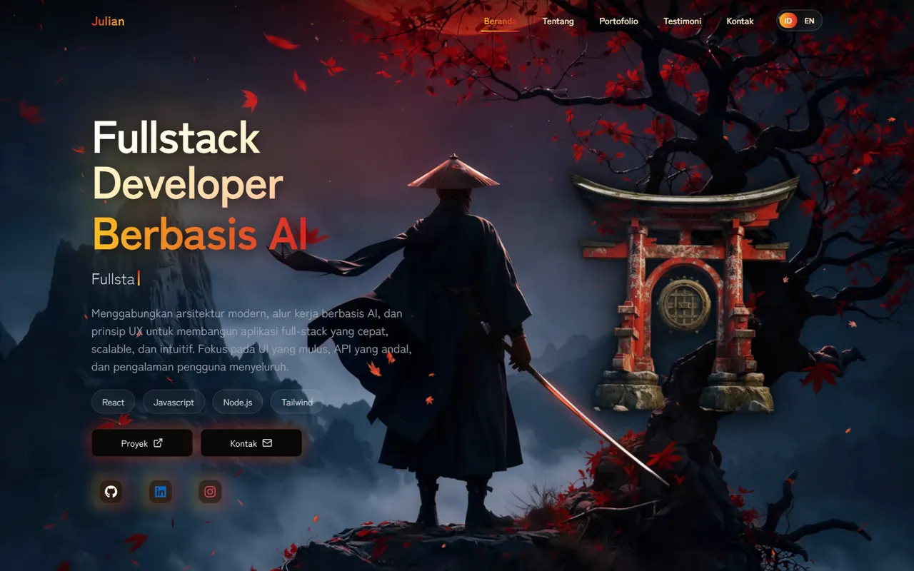
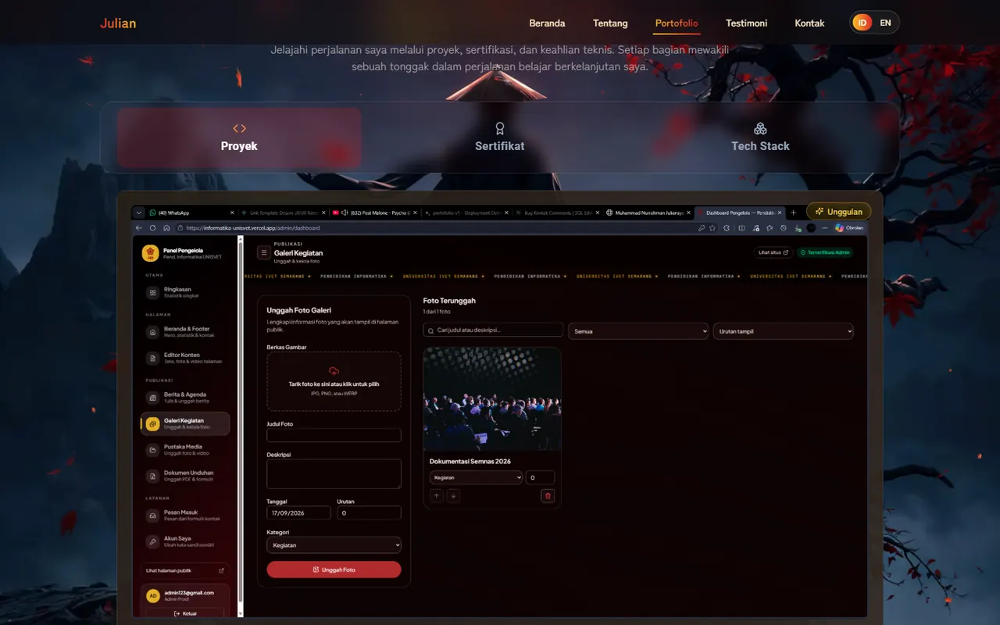
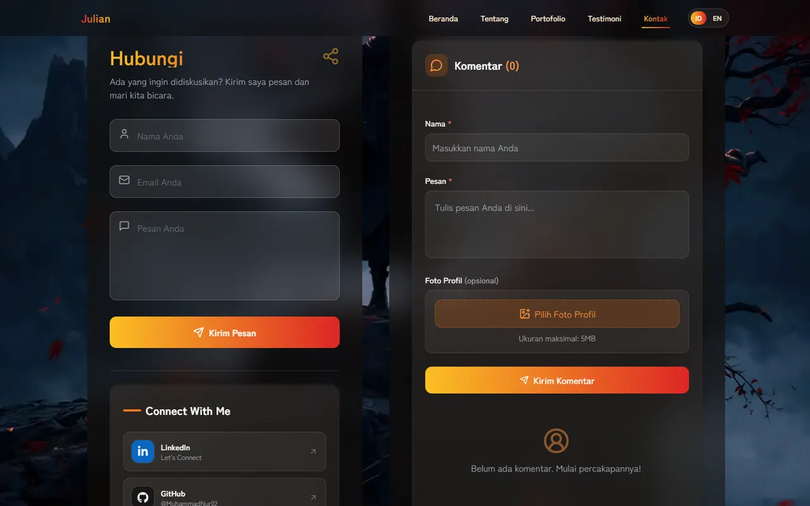
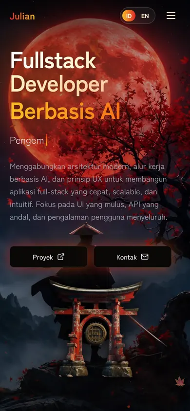

# Muhammad Nurrahman Juliansyah — Portfolio

[](https://github.com/MuhammadNur02/Portofolio-V1/actions/workflows/ci.yml)

A bilingual (Bahasa Indonesia / English) portfolio for an **AI-assisted fullstack developer**: a real-time 3D backdrop, a cinematic welcome screen, and an admin dashboard that lets me update every project, certificate and testimonial without touching code.

**Live:** https://portofolio-v1-one-gamma.vercel.app

<p align="center">
  
</p>

<p align="center">
  
  
</p>

<p align="center">
  
  
</p>

## Highlights

- **Real-time 3D backdrop (Three.js).** The wallpaper is a texture on a plane pinned to the camera, so it always covers the screen at its native sharpness while 3D leaves fall in front and drift with scroll. Phones get a lighter rendition of the artwork.
- **Cinematic welcome screen** with an animated loading bar. It plays once per session and can be skipped.
- **Admin dashboard** (Supabase auth): manage projects, certificates, experience, testimonials and comments. The dashboard is code-split, so regular visitors never download it.
- **Shareable project pages.** A project URL opened directly (no cache) loads from the database; unknown slugs get a friendly not-found view, unknown URLs a proper 404 page.
- **Bilingual UI** (ID/EN) — the `<html lang>` attribute follows the switch.
- **Accessibility:** skip-to-content link, semantic links (no buttons nested inside anchors), reduced-motion support, alt text on images, Lighthouse accessibility score of 100.
- **SEO ready:** canonical URL, Open Graph / Twitter card with a dedicated 1200×630 image, JSON-LD `Person` data, valid sitemap and robots.txt.
- **Spam-resistant forms:** honeypot fields and a per-browser cooldown on both the contact form and the comments, plus a link limit on comments.

## Performance

Lighthouse, mobile profile (simulated slow 4G + CPU throttling), production build, first visit:

| Metric | Before optimisation | After |
|---|---|---|
| Performance score | 47 | **87** |
| Largest Contentful Paint | 5.9 s | **3.3 s** |
| Total Blocking Time | 1,300 ms | **210 ms** |
| Time to Interactive | 7.1 s | **4.0 s** |
| Page weight | 3,183 KiB | **711 KiB** |
| Accessibility / Best Practices / SEO | 100 / 96 / 100 | 100 / 96 / 100 |

What made the difference:

- WebP renditions of the artwork (wallpaper 2.3 MB → 0.5 MB desktop, 0.16 MB phone) chosen per device.
- The 3D scene mounts only once the browser is idle, and its canvas fades in.
- The admin dashboard and login are lazy-loaded; 15 unused packages were removed.
- Fonts are self-hosted (Latin subset) instead of a render-blocking Google Fonts request.
- The welcome screen is shown once per session instead of on every visit.

<sub>Lab measurements from a local production build; real devices and networks will vary. The single "console error" Lighthouse reports locally is the Vercel Analytics script, which only exists on Vercel.</sub>

## Tech stack

| Area | Tools |
|---|---|
| Framework | React 18, React Router 6, Vite 5 |
| Styling & motion | Tailwind CSS 3, Framer Motion, AOS, Three.js |
| Data & auth | Supabase (Postgres, Auth, Storage) |
| UI libraries | MUI (certificate viewer), Lucide + React Icons, SweetAlert2 |
| SEO & analytics | react-helmet-async, Vercel Analytics |
| Quality | ESLint 9, Vitest, GitHub Actions |
| Hosting | Vercel |

## Getting started

Requires Node.js 20 or newer.

```bash
git clone https://github.com/MuhammadNur02/Portofolio-V1.git
cd Portofolio-V1
npm install
cp .env.example .env      # then fill in your Supabase URL and anon key
npm run dev
```

| Script | What it does |
|---|---|
| `npm run dev` | Start the dev server |
| `npm run build` | Production build into `dist/` |
| `npm run preview` | Serve the production build locally |
| `npm run lint` | ESLint (the project is lint-clean) |
| `npm test` | Vitest unit and integrity tests |

> `.npmrc` sets `legacy-peer-deps=true` because `react-swipeable-views` still declares a React 16 peer range but runs fine on React 18.

## Supabase

The app expects these tables and storage buckets:

- **Tables:** `projects`, `certificates`, `experience`, `testimonials`, `portfolio_comments`, `profiles` (admin access is granted through the `role` column).
- **Storage buckets:** `project-images`, `certificate-images`, `testimonial-images`.

**Enable Row Level Security on every table.** The anon key ships to the browser by design, so RLS policies are what actually protect the data: public read on content tables, insert-only for `portfolio_comments`, and write access only for admins. The spam guards in the UI are a convenience, not a security boundary.

## Project structure

```
src/
├─ Pages/              Home, About, Portofolio, Testimonials, Contact, Login, 404, WelcomeScreen
│  └─ dashboard/       Admin sections (projects, certificates, experience, testimonials, comments)
├─ components/         SceneBackground (Three.js), Navbar, Timeline, SocialLinks, Commentar, ProjectDetail…
├─ context/            Language provider (ID/EN)
├─ translations/       All UI strings, both languages
├─ utils/              slug helper, welcome-screen session flag
└─ *.test.js           Unit tests + site integrity checks
public/                Optimised images, sitemap.xml, robots.txt
docs/screenshots/      README images
```

## Quality

- `npm run lint` and `npm test` run in CI on every push and pull request, followed by a production build (`.github/workflows/ci.yml`).
- `site-integrity.test.js` guards against silent breakage: every icon, preview image and wallpaper referenced by `index.html` or the source must exist, and the sitemap must be valid XML on the real domain.
- `translations.test.js` keeps Indonesian and English in sync.

## Deployment

Deployed on Vercel. `vercel.json` provides the single-page-app rewrite, security headers (`X-Content-Type-Options`, `X-Frame-Options`, `Referrer-Policy`, `Permissions-Policy`) and immutable caching for hashed assets. Set `VITE_SUPABASE_URL` and `VITE_SUPABASE_ANON_KEY` in the Vercel project settings.

## Author

**Muhammad Nurrahman Juliansyah** — AI-assisted fullstack developer, Informatics Education student.

[LinkedIn](https://www.linkedin.com/in/MuchammadNur/) · [GitHub](https://github.com/MuhammadNur02) · [Instagram](https://www.instagram.com/rianz_yan/) · [YouTube](https://www.youtube.com/@Julian.Alvarez02)
