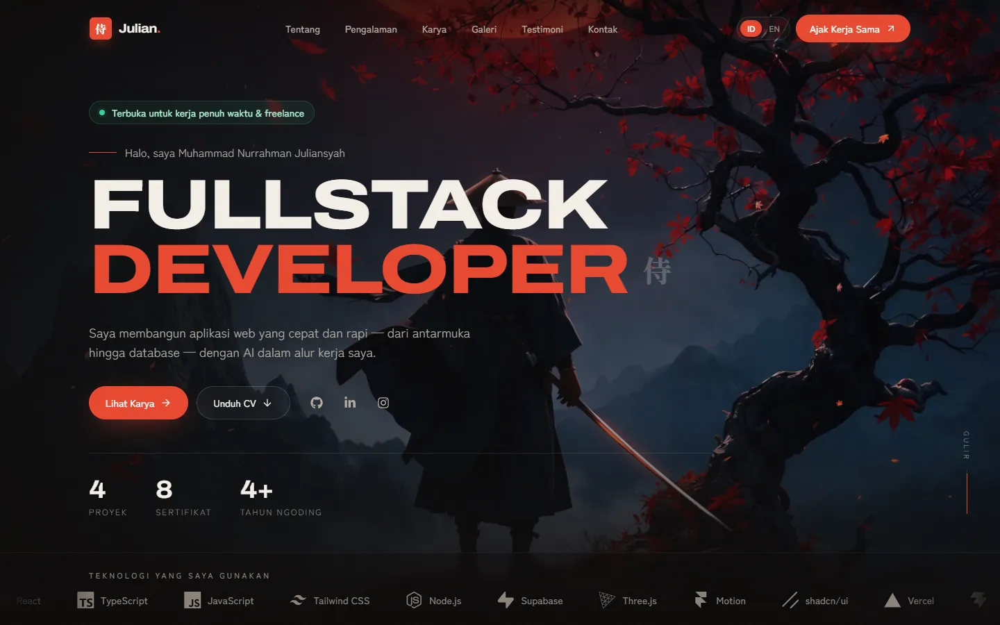
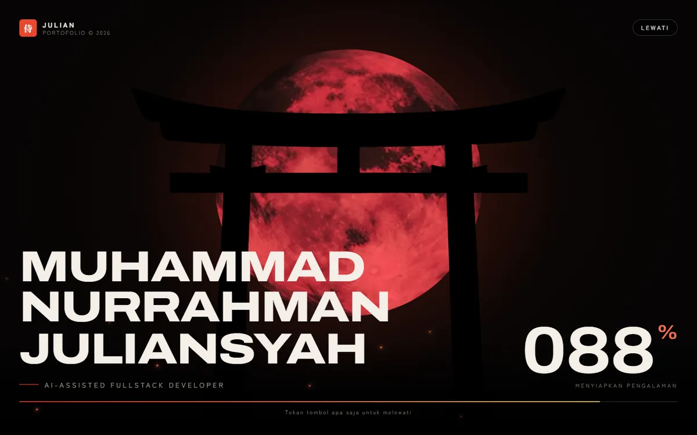
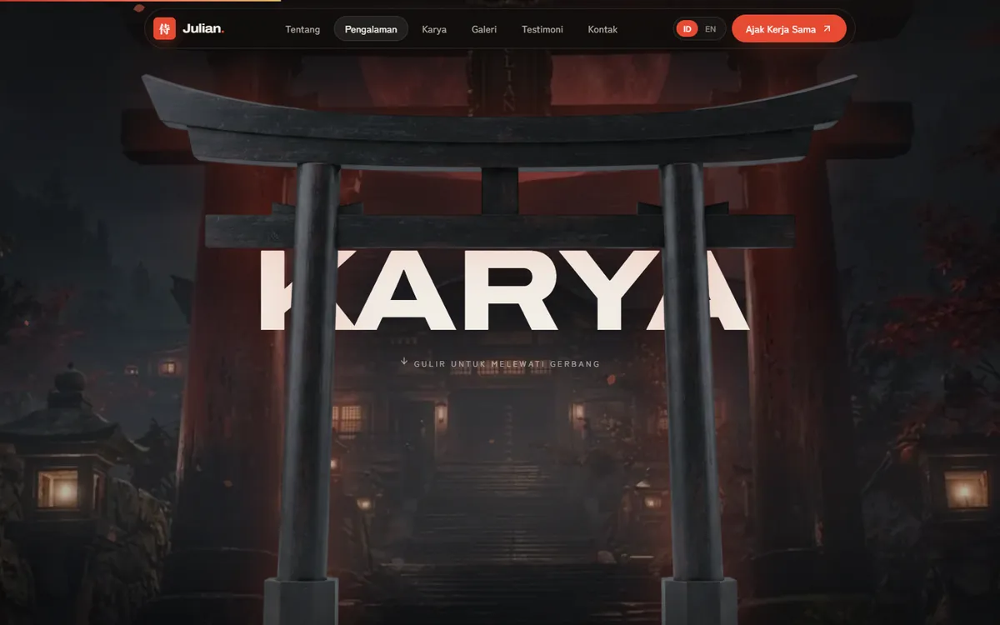
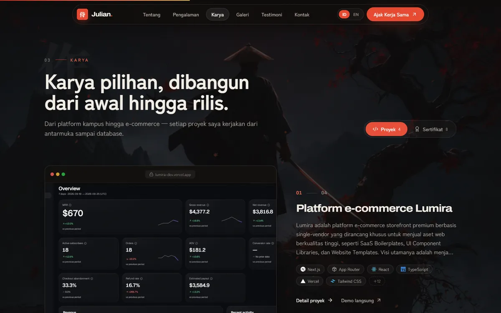
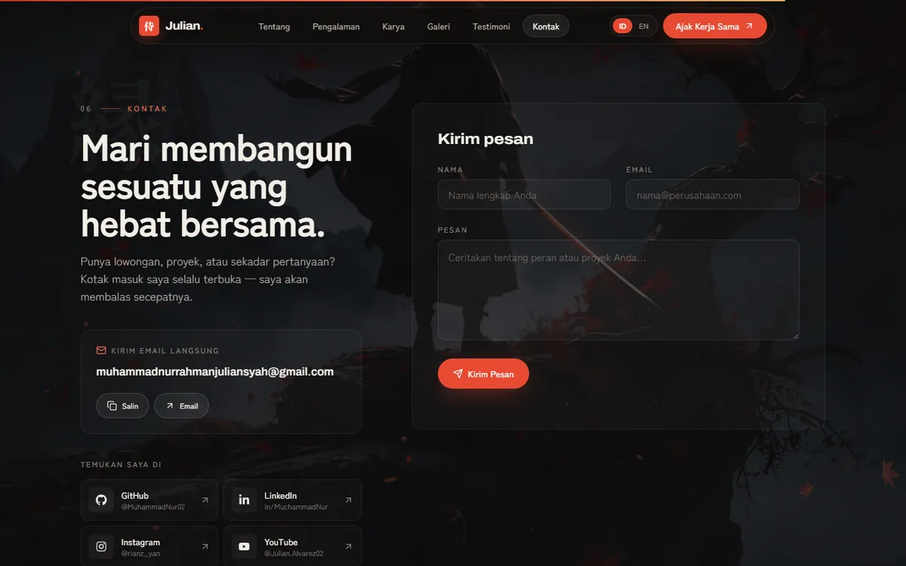
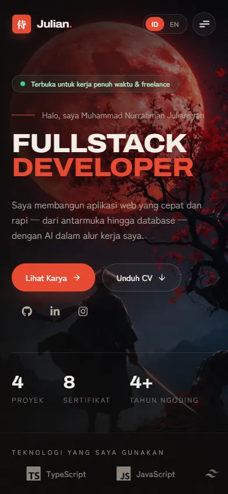

# Muhammad Nurrahman Juliansyah — Portfolio

[](https://github.com/MuhammadNur02/Portofolio-V1/actions/workflows/ci.yml)

A bilingual (Bahasa Indonesia / English) portfolio for an **AI-assisted fullstack developer**, designed around a Japanese shrine theme: a real-time 3D backdrop, a "blood-moon" intro that cuts open like a katana, a layered parallax torii gate, and an admin dashboard that updates every project, certificate, photo and testimonial without touching code.

**Live:** https://portofolio-v1-one-gamma.vercel.app

<p align="center">
  
</p>

<p align="center">
  
  
</p>

<p align="center">
  
  
  
</p>

## Highlights

- **Real-time 3D backdrop (Three.js).** The wallpaper is a texture on a plane pinned to the camera, so it always covers the screen at native sharpness while 3D leaves fall in front and drift with scroll. Past the hero a DOM shade dims it so long-form content stays readable.
- **Cinematic intro.** An eclipse shadow slides off a blood moon as the images the site needs actually load; at 100% the screen is sliced along a diagonal and the halves part to reveal the site. Plays once per session, skippable with a click or any key, and reduced to a fade for `prefers-reduced-motion`.
- **Layered parallax** (a port of Osmo's *Parallax Layers*): shrine, fog, title, petals and a foreground torii each move at their own depth, then dissolve into the backdrop through a CSS mask.
- **Case-study project rows**, a certificate grid with a keyboard-friendly lightbox, an experience timeline that draws itself on scroll, a 3D testimonial carousel and an activity-photo marquee.
- **Admin dashboard** (Supabase auth): projects, certificates, experience, testimonials, gallery photos and comments. Code-split, so visitors never download it. Sections with no data yet stay hidden instead of showing an empty box.
- **Bilingual UI** (ID/EN) — every string lives in one file and a test keeps both languages in sync.
- **Accessibility:** skip link, visible form labels, focus-visible rings, labelled icon buttons, `aria` state on tabs/menus/carousels, focus returned after closing the lightbox, reduced-motion support throughout.
- **SEO:** canonical URLs, Open Graph / Twitter cards, JSON-LD `Person` and per-project `CreativeWork`, sitemap and robots.txt.
- **Spam-resistant forms:** honeypot fields and a per-browser cooldown on both the contact form and the guestbook, plus a link limit on comments.

## UI components

Several sections are hand-ported from [21st.dev](https://21st.dev) components to plain JSX + framer-motion (the originals are TypeScript/shadcn, some GSAP-based), then themed and hardened for accessibility:

| Section | Based on |
|---|---|
| Parallax interlude | `osmosupply/parallax-scrolling` (GSAP ScrollTrigger → framer-motion `useScroll`) |
| Hero | `shadcnspace/hero-01` — headline, CTA, trust avatars + rating, logo marquee |
| Tech-stack marquee | `grootstudio/logo-marquee` — mask-faded edges, hover-to-slow |
| Activity gallery | `ravikatiyar162/hero-3` — word-by-word reveal over tilted photo marquees |
| Experience | `shadcnui-blocks/timeline-02` |
| Testimonials | `maxim.bort.devel/circular-testimonials` |
| Scroll progress | `skyleen77/scroll-progress` |
| Mobile menu icon | `efferd/menu-toggle-icon` |

## Tech stack

| Area | Tools |
|---|---|
| Framework | React 18, React Router 6, Vite 5 |
| Styling & motion | Tailwind CSS 3, Framer Motion, Lenis (smooth scroll), Three.js |
| Data & auth | Supabase (Postgres, Auth, Storage, Realtime) |
| Icons & type | Lucide, React Icons (brand logos), Archivo (variable width), Zen Kaku Gothic New, Shippori Mincho (subset) |
| SEO & analytics | react-helmet-async, Vercel Analytics |
| Quality | ESLint 9, Vitest, GitHub Actions |
| Hosting | Vercel |

## Performance notes

Lighthouse on a local production build: **Accessibility 100 · SEO 100 · Best Practices 96** (the missing points are console errors that only exist locally — the Vercel Analytics script, which is served on Vercel only). Desktop performance lands around 80 (FCP 0.7 s, LCP 1.0 s); most remaining main-thread time is the intro animation and the Three.js scene, both deliberate.

- Images are WebP and sized per use (the torii artwork went from a 1.4 MB PNG to 45–108 KB renditions served via `srcset`; the moon from 5.6 MB to 64 KB).
- Dashboard uploads are resized (longest side 1600 px) and re-encoded as WebP in the browser before they reach Supabase Storage.
- Sections below About render after the first paint inside a React transition, so the work is time-sliced instead of one long task; the Supabase client is loaded on first use, and the guestbook opens its realtime socket only when scrolled near.
- The decorative kanji font is subset to the dozen glyphs the site uses — **3 KB** instead of the 1.4 MB full Japanese font. Add a new kanji? Regenerate the subset (see the note in `src/index.css`).
- Every section after About, the intro, the 3D scene, the project page and the dashboard are lazy-loaded; React, Motion and Supabase ship as long-cached vendor chunks.
- The 3D scene mounts only once the browser is idle, and marquees stop animating while off-screen.
- MUI, Emotion, AOS, SweetAlert2, axios and react-swipeable-views were removed in the redesign.

## Getting started

Requires Node.js 20 or newer.

```bash
git clone https://github.com/MuhammadNur02/Portofolio-V1.git
cd Portofolio-V1
npm install
cp .env.example .env      # then fill in your Supabase URL and anon key
npm run dev
```

| Script | What it does |
|---|---|
| `npm run dev` | Start the dev server |
| `npm run build` | Production build into `dist/` |
| `npm run preview` | Serve the production build locally |
| `npm run lint` | ESLint (the project is lint-clean) |
| `npm test` | Vitest unit and integrity tests |

In `npm run dev`, sections whose table is still empty (experience, testimonials, gallery) show clearly-badged sample content so the layout can be reviewed; production builds never include it.

Personal details — name, email, CV link, social profiles, "available for work" badge — live in one file: `src/config/site.js`.

## Supabase

The app expects these tables and storage buckets:

- **Tables:** `projects`, `certificates`, `experience`, `testimonials`, `gallery`, `portfolio_comments`, `profiles` (admin access is granted through the `role` column).
- **Storage buckets:** `project-images`, `certificate-images`, `testimonial-images`, `gallery-images`, `profile-images`.

The gallery table, its bucket and their policies are created by [`supabase/gallery.sql`](supabase/gallery.sql) — run it once in the Supabase SQL editor. [`supabase/security-check.sql`](supabase/security-check.sql) lists RLS status and every policy, so over-broad write access is easy to spot.

**Disable public sign-ups** (Authentication → Sign In / Providers → Email → "Allow new users to sign up"): the admin account already exists, and policies that trust any `authenticated` user are only safe when nobody else can create one.

**Enable Row Level Security on every table.** The anon key ships to the browser by design, so RLS policies are what actually protect the data: public read on content tables, insert-only for `portfolio_comments`, and write access only for admins. The spam guards in the UI are a convenience, not a security boundary.

## Project structure

```
src/
├─ Pages/              Home (hero), About, Experience, WorksParallax, Portofolio, Gallery,
│  │                   Testimonials, Contact, WelcomeScreen, Login, 404
│  └─ dashboard/       Admin sections (projects, certificates, experience, testimonials, gallery, comments)
├─ components/
│  ├─ ui/              Ported 21st.dev components + shared pieces (Reveal, SectionHeading, Lightbox…)
│  └─                  SceneBackground (Three.js), Navbar, Footer, Commentar, ProjectDetail
├─ config/site.js      Name, email, CV, socials, availability
├─ lib/                Data hook (Supabase), smooth scroll, tech-name registry, dev preview data
├─ context/            Language provider (ID/EN)
├─ translations/       All UI strings, both languages
└─ *.test.js           Unit tests + site integrity checks
public/                Optimised images, sitemap.xml, robots.txt
supabase/              SQL for the gallery table and bucket
docs/screenshots/      README images
```

## Quality

- `npm run lint` and `npm test` run in CI on every push and pull request, followed by a production build (`.github/workflows/ci.yml`).
- `site-integrity.test.js` guards against silent breakage: every icon, preview image and wallpaper referenced by `index.html` or the source must exist, and the sitemap must be valid XML on the real domain.
- `translations.test.js` keeps Indonesian and English in sync; `tech.test.js` checks that hand-typed stack names ("Tail WInd", "Next.js 16.x") resolve to the right brand.
- Error boundaries keep one failing section from blanking the page, and a stale chunk after a new deploy triggers a single automatic reload.

## Deployment

Deployed on Vercel. `vercel.json` provides the single-page-app rewrite, security headers (`X-Content-Type-Options`, `X-Frame-Options`, `Referrer-Policy`, `Permissions-Policy`) and immutable caching for hashed assets. Set `VITE_SUPABASE_URL` and `VITE_SUPABASE_ANON_KEY` in the Vercel project settings.

## Author

**Muhammad Nurrahman Juliansyah** — AI-assisted fullstack developer, Informatics Education student.

[LinkedIn](https://www.linkedin.com/in/MuchammadNur/) · [GitHub](https://github.com/MuhammadNur02) · [Instagram](https://www.instagram.com/rianz_yan/) · [YouTube](https://www.youtube.com/@Julian.Alvarez02)
